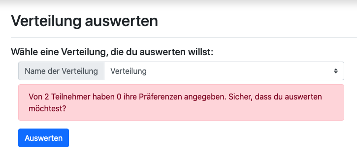
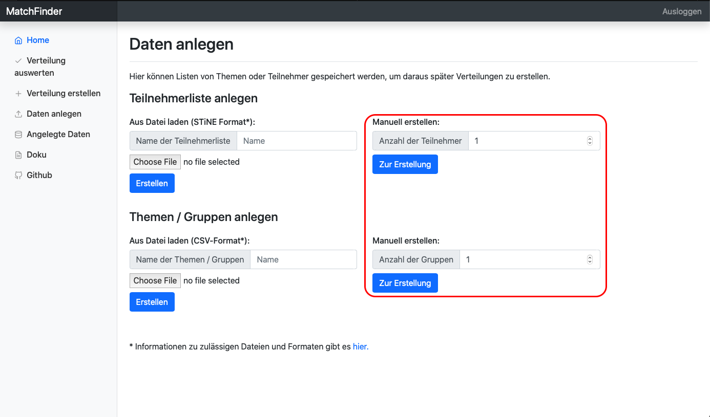
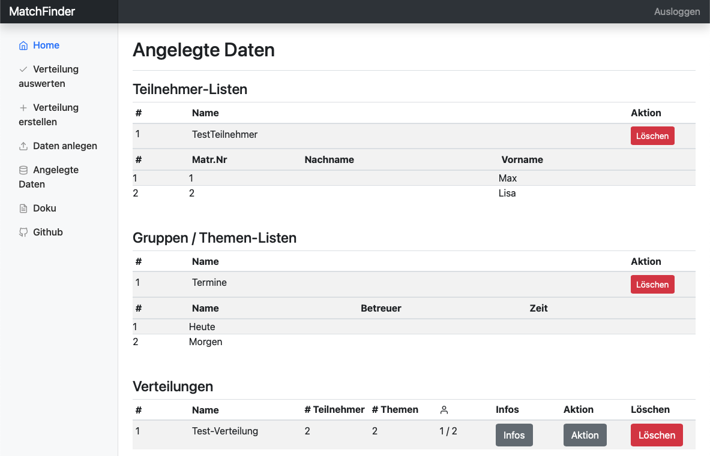

## [Zurück zur Übersicht](../dokumentation.md)

# Fachliches

## Inhaltsverzeichnis

- [Home](#home)
- [Verteilung auswerten](#verteilung-auswerten)
	- [aus Datei](#verteilung-aus-einer-datei-auswerten)
	- [aus Datenbankdaten](#verteilung-aus-datenbankdaten-auswerten)
- [Resultate einer Auswertung](#resultate-einer-auswertung)
- [Verteilung erstellen](#verteilung-erstellen)
- [Daten anlegen](#daten-anlegen)
	- [per Formular]()
		- [Teilnehmer](#teilnehmer)
		- [Themen / Gruppen](#gruppen-themen)
	- [aus Datei](#erstellung-mittels-datei)
		- [Teilnehmer](#teilnehmer)
		- [Themen / Gruppen](#gruppen-themen)
- [Angelegte Daten](#angelegte-daten)
- [Vorschau](#vorschau)
- [Präferenzvergabe](#praferenzvergabe)

## Home

Auf der Home-Seite (```/```) findet der Nutzer allgemeine Informationen über den Dienst und die angebotenen Funktionen. Sie ist sowohl über den Menüpunkt *Home* als auch über den Schriftzug *MatchFinder* in der oberen Leiste zu erreichen.

## Verteilung auswerten

Über den Menüpunkt *Verteilung auswerten* (```/evaluate```) wird die Funktion angeboten, Verteilungen (aus Dateien oder aus Datenbankdaten) auszuwerten. Die volle Funktionalität steht nur einem authentifizierten Benutzer zu Verfügung. Nicht authentifizierte Benutzer haben nur Zugriff auf die Funktion eine Verteilung aus einer Datei auszuwerten:

### Verteilung aus einer Datei auswerten

Eine Verteilung kann ausgewertet werden, wenn die Präferenzen als CSV-Datei vorliegen. Voraussetzung hierfür ist, dass die Datei folgendem Format folgt:

1. die durch die Datei beschriebene Matrix ist rechteckig (alle Zeilen haben gleiche Länge)
2. in der ersten Zeile sind die Namen der Gruppen / Themen, wobei Zelle 0,0 frei bleibt bzw. nur einen Platzhalter beinhaltet
3. in der ersten Spalte befinden sich die Namen der Teilnehmer. Sie dürfen Leerzeichen enthalten, aber keine Kommata
4. die Präferenzen sind als Bezeichnung angegeben, nicht als Zahl (Erstwahl statt 1, Zweitwahl statt 2 etc.)
5. die maximal auszugebende Präferenz ist die Zehntwahl, darüber hinaus werden keine weiteren Präferenzen angegeben

**Beispielformat**: Eine formatgerechte Datei sieht demnach so aus:

```
PLATZHALTER,Thema1,Thema2,Thema3,Thema4
Teilnehmer1,Erstwahl,Zweitwahl,Drittwahl,Viertwahl
Teilnehmer2,Viertwahl,Drittwahl,Zweitwahl,Erstwahl
Teilnehmer3,Erstwahl,Zweitwahl,,
Teilnehmer4,,Zweitwahl,Drittwahl,Erstwahl
```

Für eine optimale Auswertung sollten so viele Angaben wie möglich gemacht werden.

Soll eine Verteilung ausgewertet werden, kann dies mit dem Auswählen des *Auswerten*-Knopfes veranlasst werden. Der Benutzer wird auf eine neue Seite weitergeleitet. Diese ist [hier](#resultate-einer-auswertung) näher beschrieben.

### Verteilung aus Datenbankdaten auswerten

Sind noch keine Daten in der Datenbank angelegt, steht dem authentifizierten Benutzer die gleiche Funktionalität (wie [oben](#verteilung-aus-einer-datei-auswerten) beschrieben) zur Verfügung. Er erhält außerdem noch einen Verweis auf die *Verteilung anlegen*-Funktion, über welche er eine Verteilung anlegen kann.

Existiert jedoch eine Verteilung in der Datenbank, kann diese ausgewählt werden, um sie auszuwerten. Unter dem Auswahlelement wird u. U. darauf hingewiesen, dass eine Auswertung noch nicht ausgewertet werden sollte. Beispiel:



Dies kann mehrere Gründe haben:

1. kein Teilnehmer hat an der Verteilung teilgenommen
2. nicht alle Teilnehmern haben an der Verteilung teilgenommen (wie im Beispiel, die Schwelle liegt bei 80%)
3. Es haben mehr Teilnehmer an der Verteilung teilgenommen, als es Plätze gibt (Anzahl Plätze = Anzahl Themen * erlaubte Teilnehmer pro Thema). Dies kann nur bei offenen Verteilungen vorkommen, bei denen die Anzahl der Teilnehmer im Voraus nicht bekannt ist.

Während 1-2 lediglich Warnungen sind, führt 3. dazu, dass die Verteilung nicht ausgewertet werden kann. Die Verteilung muss erneut erstellt und Präferenzen erneut vergeben werden.

Kann eine Verteilung ausgewerten, kann dies mit dem Auswählen des *Auswerten*-Knopfes veranlasst werden. Der Benutzer wird auf eine neue Seite weitergeleitet. Diese ist [hier](#resultate-einer-auswertung) näher beschrieben.

### Resultate einer Auswertung

In der Abbildung


ist beispielhaft dargestellt, wie die Resultate einer Auswertung präsentiert werden. Je nach Datenlage gibt es 1-n mögliche Verteilungen von Teilnehmern aus Themen, welche alle die gleichen optimalen (d.h. optimalen) Gesamtkosten haben. Gibt es mehr als eine solcher Resultate, werden diese untereinander angezeigt, wobei nach dem Median und der absoluten Abweichung des Medians sortiert wird. Das beste Resultat ist immer das Oberste. Hier ein Beispiel zur Erklärung:

Verteilung1 habe die Kosten [2,2,2], Verteilung2 die Kosten [1,2,3]. Damit haben beide Verteilungen einen Median von 2. Jedoch ist die absolute Abweichung vom Median bei Verteilung1 0, während sie bei Verteilung2 2 ist.
In diesem Anwendungsfall ist eine geringere Abweichung besser, also wird Verteilung1 gegenüber Verteilung2 bevorzugt und über ihr angezeigt.
Pro Verteilungsvariante wird nun angezeigt, welcher Student welches Thema bekommen hat und die wievielte Wahl es jeweils war.

#### Export

Die Seite bietet dem Benutzer Exportfunktionen in zwei Formaten an:

1. **CSV-Datei**: Hier wird die Tabelle ins CSV-Format umgewandelt und ausgegeben, nützlich für Programme wie Microsoft Excel o.ä.
2. **WikiDocs-Format**: Speziell implementiert für den Arbeitsbereich Wissenschaftliches Rechnen an der UHH, die auf ihrer Webseite WikiDocs verwenden. Bei diesem Format handelt es sich um eine verändertes Markdown.

## Verteilung erstellen

*Dieser Seitenabschnitt steht nur authentifizierten Benutzern zur Verfügung.*

Sind zuvor Teilnehmer und Gruppen angelegt worden, kann auf dieser Unterseite eine Verteilung erstellt werden. Wenn nicht, beinhaltet die Seite einen Verweis auf die [*Daten-anlegen*](#daten-anlegen)-Funktion, über welche dann Teilnehmer und Gruppen / Themen erstellt werden können.

Verteilungen zu erstellen bedeutet, zu einer gegebenen Liste von Themen eine Liste an Teilnehmern (vorausgesetzt, die Verteilung ist geschützt) zuzuordnen und den Teilnehmern die Möglichkeit zu geben, ihre Präferenzen zu den Themen abzugeben. Eine Verteilung wird dabei beschrieben durch eine Reihe von Eigenschaften:

Eine Verteilung wird dabei beschrieben durch eine Reihe von Eigenschaften:

- **Name**: Jede Verteilung braucht einen Namen, um sie später identifizieren zu können, wenn die Verteilung ausgewertet werden soll
- **Gruppenliste**: Die Liste der Gruppen / Themen, zu denen Präferenzen angegeben werden sollen
- **# / Gruppe**: Diese Eigenschaft gibt an, wie viele Teilnehmer auf eine Gruppe kommen dürfen. Beispiel: Ist *# / Gruppe = 1*, so darf nur ein Teilnehmer auf jede Gruppe verteilt werden, eine 1:1 Beziehung. Ist *# / Gruppe = n*, mit n > 1, handelt es sich um eine 1:n Beziehung, wobei nur dann jede Gruppe voll ist, wenn es genau ```längeDerGruppeliste * # / Gruppe``` Teilnehmer gibt.
- **Mindeststimmen**: Gibt an, wie viele Präferenzen jeder Teilnehmer mindestens vergeben muss. Dabei ist der Wert nach unten bis 1 und nach oben bis 10 bzw. Anzahl der Themen beschränkt (je nach dem, was zuerst eintritt).
- **Veto erlaubt**: Wenn der Haken gesetzt ist darf ein Teilnehmer eine der angebotenen Themen / Gruppen vollkommen ausschließen.
- **geschützt**: Ist diese Option angewählt, muss sich jeder Teilnehmer mit seiner Matrikelnummer gegenüber dem System authentifizieren, bevor er seine Präferenzen angeben darf. Ist die Option nicht ausgewählt fallen die beiden nächsten Optionen weg
- **Teilnehmerliste**: Soll die Verteilung geschützt sein, muss im Vorhinein feststehen, welche Teilnehmer teilnehmen werden. Über diese Option wird diese Teilnehmerliste ausgewählt.
- **editierbar**: Diese Option gibt an, ob Teilnehmer nach dem ersten Bestätigen ihrer Präferenzen ihre Angabe erneut anpassen dürfen. Diese Funktion gilt für alle Teilnehmer und unbegrenzt oft.

Mit dem Auswählen des *Erstellen*-Knopfes wird die Verteilung erstellt und der Benutzer wird auf eine Seite weitergeleitet, auf welcher die Verteilung geteilt werden kann.

## Verteilung teilen

*Dieser Seitenabschnitt steht nur authentifizierten Benutzern zur Verfügung.*

Auf dieser Seite kann eine erstellte Verteilung geteilt werden. Zu diesem Zweck wird der Link angezeigt, welcher benötigt wird, um zu der Verteilung zu navigieren. Darunter ist ein QR-Code, welcher von den Teilnehmern gescannt werden kann, er führt ebenfalls zur Präferenzvergabe.

## Daten anlegen

*Dieser Seitenabschnitt steht nur authentifizierten Benutzern zur Verfügung.*

Um eine Verteilung aus Datenbankdaten erstellen zu können, müssen diese im Voraus angelegt werden. Diese Funktionalität bietet der Unterpunkt *Daten anlegen* (```/upload```).

Die App arbeitet mit zwei Arten von Daten: Teilnehmer und Gruppen bzw. Themen. Beide lassen sich über einen Datei-Upload oder per Formular erstellen.

### Erstellung mittels Formular

Liegen die Daten nicht als Dateien vor, ist die Erstellung mittels Formular eine effiziente und angenehme Art, dies zu ändern. Hierzu muss vor der eigentlichen Erstellung zunächst festgelegt werden, wie viele Teilnehmer oder Gruppen / Themen angelegt werden sollen:



Es muss mindestens ein Teilnehmer oder eine Gruppe angelegt werden. Nach oben gibt es keine Beschränkung.

An Verteilungen können immer nur ganze Gruppen von Teilnehmern teilnehmen. Es gibt **nicht** die Möglichkeit, nach der Erstellung einer Gruppen- oder Teilnehmerliste die dazugehörigen Gruppen oder Teilnehmer zu bearbeiten, d.h. die Daten zu verändern oder Einträge zu löschen / hinzuzufügen. Diese Listen sind erst zu erstellen, wenn alle Einträge feststehen.

Bei der Erstellung von Teilnehmern oder Gruppen / Themen gibt es Informationen, die ausgefüllt werden müssen, während andere optional sind. Der Name der Teilnehmer- bzw. Gruppenliste ist immer erforderlich, die Notwendigkeit der weiteren Feldern ist den Tabellen zu entnehmen:

#### Teilnehmer

| Feld 			| benötigt	|
|---------------|-----------|
| Vorname		| Ja		|
| Nachname		| Nein		|
| Matrikelnummer| Ja 		|

#### Gruppen / Themen

| Feld 		| benötigt	|
|-----------|-----------|
| Name		| Ja		|
| Uhrzeit	| Nein		|
| Betreuer	| Nein 		|

Sind die benötigten Felder nicht ausgefüllt, lässt sich die Verteilung nicht erstellen.

Wenn die Erstellung erfolgreich war, wird der Benutzer zur vorherigen Seite zurückgeleitet und es erscheint ein kleines Banner, welches Auskunft über die Anzahl der erstellen Einträge gibt.

Erstellte Daten können unter [*Angelegte Daten*](#angelegte-daten) betrachtet und bearbeitet werden.

### Erstellung mittels Datei

Alternativ zum Formular können Daten auch per Datei erstellt werden. Hier sind besonders die Formatvorgaben zu beachten.

Für beide Datentypen gilt: die Dateien müssen auf .csv oder .txt enden.

#### Teilnehmer

Während die Themen / Gruppen im standardmäßigen CSV-Format angegeben werden, ist dies bei den Teilnehmern anders. Hier werden die Spalten mit Tabs getrennt. Dies liegt daran, dass es besonders einfach sein soll, Teilnehmer aus STiNE zu exportieren und in MatchFinder zu importieren. Also muss Matchfinder dem Format von STiNE folgen. Da STiNE die Listen je nach Kontext in zwei Darstellungen exportiert, unterstützt MatchFinder auch beide.

Hier beide Varianten:

Variante 1:

```
Id <TAB> Matrikelnummer <TAB> Nachname <TAB> Vorname <TAB>
```

Variante 2:

```
Id <TAB> Matrikelnummer <TAB> Nachname <TAB> Vorname <TAB> Zeitpunkt <TAB>
```

Beispieldateiinhalt Variante 1:

```
1 	1234567 	Mustermann 	Max 		Übungen Gr. 03 (Do. 10-12 Uhr)
2 	7654321 	Musterfrau 	Marie 		Übungen Gr. 05 (Do. 14-16 Uhr)
```

Der Inhalt der Zeitpunkt-Spalte aus Variante zwei wird verworfen.

#### Themen / Gruppen

Themen / Gruppen werden als CSV-Dateien hochgeladen, dabei ist das Format:

```
Name, Zeit, Betreuer
```

Beispiel:

```
Thema1,Heute,Frau Schmidt
Thema2,Morgen,Herr Schultz
Thema3,,Ich
Thema4,Nächste Woche,
Thema5,,
```

## Angelegte Daten



Die Seite *Angelegte Daten* (```/edit```) bietet die Funktion, die angelegten Daten zu betrachten und zu bearbeiten. Die Seite ist in vier Abschnitte aufgeteilt: Jeweils eine Tabelle für Teilnehmer, Gruppen / Themen und Verteilungen und eine Legende. Die Legende zeigt nur diejenigen Symbole an, die für die existierenden Daten relevant sind. Gibt es keine Daten, wird die Legende ausgeblendet.

Die Tabellen für Teilnehmer und Gruppen / Themen zeigen auf oberster Ebene die Listen von Teilnehmer bzw. Gruppen Themen und es wird eine Löschfunktion angeboten. Listen lassen sich nur als Ganzes löschen und die einzelnen Einheiten können nicht bearbeitet werden. Bevor ein Eintrag endgültig gelöscht wird, wird der Benutzer um Bestätigung gebeten, um ein versehentliches Löschen zu vermeiden. Durch einen Klick auf eine Liste wird die Tabelle ausgeklappt und der Listeninhalt wird angezeigt.

Die Tabelle der Verteilungen kann nicht ausgeklappt werden. Über den Infos-Knopf wird ein Tooltip angezeigt, in dem sich weitere Details und Parametereinstellungen (z.B. ob sie geschützt ist) befinden. Über den Aktion-Knopf kann die Verteilung ausgewertet, geteilt oder in der Vorschaufunktion (siehe Abschnitt [Vorschau](#vorschau)) betrachtet werden. Die Teilen-Funktion leitet den Benutzer zur [Teilen-Seite](#verteilung-teilen)weiter, die Löschfunktion wird ebenfalls angeboten.

Werden Themen- oder Teilnehmerlisten gelöscht, die Teil von bestehenden Verteilungen sind, werden diese Verteilungen ebenfalls gelöscht.

Die Tabelle der Verteilungen kann nicht ausgeklappt werden, sie bietet jedoch als Aktionen die Löschfunktion und eine Funktion zum Teilen. Die Teilen-Funktion leitet den Benutzer zur [Teilen-Seite](#verteilung-teilen) weiter.

## Vorschau

Über die *Vorschau*-Funktion (```/preview```) können die Präferenzen der Teilnehmer einer Verteilung eingesehen werden. Dies ist besonders nützlich, um herauszufinden, welche Teilnehmer noch nicht ihre Präferenzen angegeben haben. Zusätzlich kann die Vorschau-Funktion dazu dienen, die zugrundeliegenden Daten von Verteilungsergebnissen einzusehen.

Die folgende Abbildung zeigt eine Beispielverteilung mit den Teilnehmer Max und Lisa und den Gruppen Heute und Morgen. Während Max seine Präferenzen schon verteilt hat, hat Lisa noch keine angegeben.


Eine Verteilung kann in der Vorschau über den entsprechenden Knopf unter ```Aktion``` auf der ```Angelegte Daten```-Seite betrachtet werden.

## Präferenzvergabe

Bei der Präferenzvergabe prioritisiert ein Teilnehmer die ihm/ihr angebotenen Gruppen oder Themen.
Die Priorität wird von Erstwahl bis Zehntwahl angegeben, u. U. kann ein Thema mittels Veto ausgeschlossen werden.

Bei den Verteilungen wird zwischen offenen und geschützten Verteilungen unterschieden. Ist die Verteilung geschützt wird der Benutzer aufgefordert, sich mittels seiner Matrikelnummer zu authentifizieren, bevor die Präferenzen vergeben werden können. Ist die Verteilung offen, hat er stattdessen die Möglichkeit, seinen Vor- und Nachnamen einzutragen, wobei nur der Vorname Pflicht ist.

Wird bei der Präferenzvergabe eine der Antwortmöglichkeiten (z.B. Erstwahl) für eine der Themen angegeben, verschwindet diese Priorität aus den Antwortmöglichkeiten der anderen Themen. Themen, die mit 'Keine Präferenz' markiert sind, werden vom System mit passenden, zufälligen Gewichten versehen, um eine faire und sichere Verteilung zu gewährleisten.

## [zurück nach oben](#zuruck-zur-ubersicht)